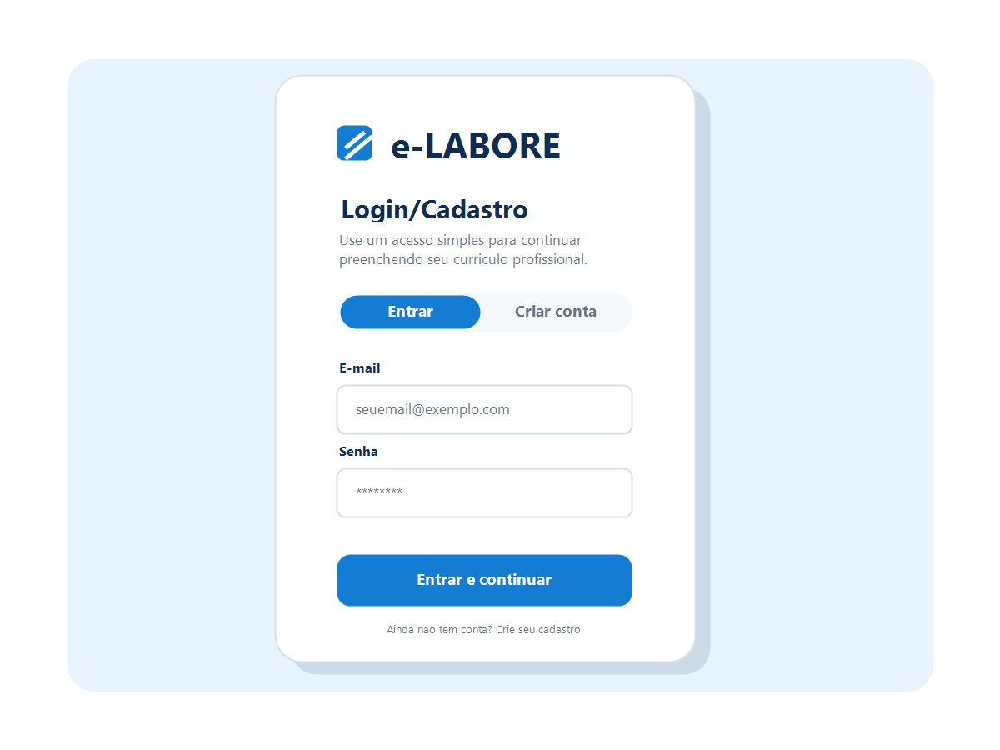

# Projeto de Interface

Visão geral da interação do usuário pelas telas do sistema e protótipo das interfaces que fazem parte do e-LABORE.

O projeto **e-LABORE** foi concebido para permitir que qualquer usuário monte um currículo profissional de forma simples, guiada e responsiva, mesmo sem experiência prévia com editores de texto. A interface foi estruturada para atender principalmente pessoas em situação de desemprego, informalidade, busca do primeiro emprego ou transição de carreira, conforme definido na [Documentação de Contexto](context.md).

A proposta da plataforma é reduzir a carga cognitiva do usuário com um fluxo dividido em etapas curtas, linguagem simples, visualização prévia em tempo real e geração do currículo final em PDF. O fluxo inclui uma tela de **login/cadastro** logo após a landing page, permitindo que o usuário inicie a experiência no sistema antes de preencher o currículo.

As interfaces foram elaboradas para atender diretamente os seguintes pontos do projeto:

- **RF-001**: apresentação da landing page;
- **RF-002**: login e cadastro simples;
- **RF-003**: envio opcional de foto;
- **RF-004**: preenchimento de dados pessoais e contato;
- **RF-005**: preenchimento da mini-bio;
- **RF-006**: cadastro de experiências profissionais;
- **RF-007**: cadastro de educação;
- **RF-008**: cadastro de habilidades;
- **RF-009**: pré-visualização do currículo;
- **RF-010**: geração e download do PDF;
- **RNF-001**: responsividade para celular, tablet e desktop;
- **RNF-002**: linguagem simples e clareza visual;
- **RNF-003**: acessibilidade e legibilidade;
- **RNF-004**: funcionamento sem backend.

## User Flow

O fluxo de usuário do **e-LABORE** foi planejado para ser direto, linear e intuitivo. O usuário inicia na **landing page**, onde entende rapidamente a proposta da plataforma e pode optar por começar a criação do currículo. Em seguida, acessa a tela de **login/cadastro** e, depois disso, entra no processo guiado de montagem do documento.

O fluxo principal segue a seguinte lógica:

1. **Landing page**: apresenta a proposta de valor da plataforma e os botões de ação principais;
2. **Login/Cadastro**: permite entrar no sistema ou criar um acesso simples;
3. **Envio de foto**: etapa opcional, permitindo enviar ou pular;
4. **Seus Detalhes**: preenchimento das informações pessoais e profissionais básicas;
5. **Mini-Bio**: inserção de um resumo profissional;
6. **Experiência**: cadastro das experiências de trabalho;
7. **Educação**: preenchimento da formação acadêmica;
8. **Habilidades**: inserção das competências do usuário;
9. **Pré-visualização final**: acompanhamento visual contínuo do currículo montado;
10. **Download do PDF**: geração e exportação do currículo final.

Esse fluxo atende principalmente às histórias de usuário relacionadas ao preenchimento simplificado, uso por celular, apoio ao primeiro emprego e valorização de experiências profissionais informais. A presença de um preview ao lado do formulário ajuda o usuário a compreender imediatamente o impacto das informações inseridas, reduzindo insegurança e retrabalho.

## Wireframes

Os wireframes e telas do **e-LABORE** foram desenhados para manter consistência visual, navegação previsível e preenchimento progressivo. O sistema utiliza uma barra superior de etapas para indicar o progresso do usuário e uma área de visualização do currículo em tempo real, o que reforça o senso de avanço e facilita revisões.

A seguir, são apresentadas as principais interfaces da plataforma e sua relação com os requisitos do projeto.

---

### 1. Landing Page

A tela inicial tem como objetivo apresentar a solução de forma clara e rápida. O título principal comunica o benefício central da ferramenta, enquanto os botões de ação conduzem o usuário para o início do processo ou para a visualização de modelos.

Nesta tela, são atendidos principalmente os seguintes pontos:

- apresentação clara da proposta da plataforma;
- entrada simples no fluxo principal;
- comunicação objetiva voltada a usuários com pouca familiaridade digital;
- direcionamento para a tela de login/cadastro.

**Requisitos relacionados:** RF-001, RNF-001, RNF-002, RNF-003.

---

### 2. Login/Cadastro

A tela de login/cadastro aparece entre a landing page e o início do preenchimento do currículo. Ela permite que o usuário entre com e-mail e senha ou crie um acesso simples para continuar no sistema. Como o projeto não possui backend, essa etapa deve ser implementada no front-end, com validações básicas e persistência local quando necessário.

Essa tela foi pensada para:

- identificar o usuário antes do preenchimento do currículo;
- manter o fluxo simples e com poucos campos;
- permitir alternância clara entre login e cadastro;
- exibir mensagens de validação compreensíveis;
- preservar a proposta de acessibilidade e baixo atrito.

**Requisitos relacionados:** RF-002, RNF-001, RNF-002, RNF-003, RNF-004, RNF-005.

---

### 3. Envio de Foto

A interface de envio de foto permite que o usuário envie uma imagem profissional para compor o currículo. Como nem todos terão uma imagem disponível, existe a opção de pular essa etapa, evitando bloqueios no fluxo.

Essa tela foi pensada para:

- reduzir atrito na experiência;
- permitir personalização sem tornar a foto obrigatória;
- manter o fluxo acessível para usuários com poucos recursos;
- orientar visualmente o processo de upload.

**Requisitos relacionados:** RF-003, RNF-001, RNF-002, RNF-003.

---

### 4. Seus Detalhes

A etapa de detalhes pessoais funciona como base do currículo. Nela, o usuário informa cargo desejado, nome, sobrenome, e-mail, telefone e endereço. A organização em campos simples reduz a dificuldade de preenchimento.

Esta interface atende especialmente:

- coleta estruturada das informações principais do currículo;
- organização do formulário em seções;
- preenchimento guiado e legível;
- visualização simultânea do resultado no documento.

**Requisitos relacionados:** RF-004, RF-009, RNF-001, RNF-002, RNF-003.

---

### 5. Mini-Bio

A tela de mini-bio permite ao usuário escrever um resumo profissional curto. Essa etapa é importante para valorizar o perfil de quem já possui experiência, está em transição de carreira ou busca o primeiro emprego.

A escolha por uma área de texto maior e com editor visual ajuda o usuário a estruturar melhor sua apresentação. A visualização ao lado mostra como o texto aparecerá no currículo final.

**Requisitos relacionados:** RF-005, RF-009, RNF-001, RNF-002.

---

### 6. Experiência

Na tela de experiência, o sistema exibe os registros já cadastrados em formato de cards, com opções de edição e exclusão. Também existe um botão para adicionar novas experiências.

Essa interface foi elaborada para:

- permitir múltiplos registros profissionais;
- facilitar atualização e correção das informações;
- acomodar experiências formais e informais;
- tornar o histórico profissional mais visível e organizado.

Essa etapa é especialmente importante para atender usuários que precisam valorizar trajetórias profissionais fora da carteira assinada.

**Requisitos relacionados:** RF-006, RF-009, RNF-001, RNF-002.

---

### 7. Educação

A tela de educação segue o mesmo padrão da etapa anterior, garantindo consistência visual e facilidade de uso. O usuário pode cadastrar instituições, cursos, anos e destaques acadêmicos.

Ela contribui para:

- organização da formação acadêmica;
- inclusão de dados relevantes mesmo para usuários com pouca experiência profissional;
- consistência no padrão de cadastro e edição;
- compreensão mais fácil do fluxo por repetição visual.

**Requisitos relacionados:** RF-007, RF-009, RNF-001, RNF-002.

---

### 8. Habilidades

Na etapa de habilidades, o usuário pode destacar competências organizadas em grupos, como conhecimentos de indústria, ferramentas e outras skills. O uso de tags torna a visualização mais simples e objetiva.

Essa tela foi pensada para:

- facilitar a leitura das competências no currículo;
- permitir destaque rápido de conhecimentos importantes;
- apoiar usuários com pouca experiência formal, valorizando habilidades práticas;
- estruturar informações de forma visualmente clara.

**Requisitos relacionados:** RF-008, RF-009, RNF-001, RNF-002.

---

### 9. Pré-visualização do Currículo

A visualização do currículo aparece ao longo do fluxo, mas ganha maior relevância nas etapas finais, quando o documento já está mais completo. Ela permite revisão geral antes da exportação.

Essa funcionalidade é central no projeto, pois:

- aumenta a confiança do usuário no resultado;
- reduz erros antes da geração do PDF;
- facilita ajustes de conteúdo;
- aproxima a experiência de um editor profissional sem exigir conhecimento técnico.

**Requisitos relacionados:** RF-009, RF-010, RNF-001, RNF-002, RNF-003.

---

### 10. Download do PDF

A etapa final permite que o usuário baixe o currículo pronto em PDF. Ela deve manter uma chamada principal clara, como **Baixar PDF**, e também oferecer opção de voltar e editar caso o usuário identifique alguma informação incorreta na prévia.

Essa tela foi pensada para:

- concluir o fluxo com uma ação objetiva;
- permitir revisão antes do download;
- evitar que o usuário perca o trabalho realizado;
- reforçar que o documento está pronto para impressão ou envio.

**Requisitos relacionados:** RF-010, RNF-001, RNF-002.

---

## Considerações sobre a Interface

A interface do **e-LABORE** foi desenvolvida com foco em simplicidade, orientação progressiva e previsibilidade. As principais decisões de design observadas nas telas são:

- **divisão do formulário em etapas curtas**, reduzindo sobrecarga cognitiva;
- **login/cadastro simples**, mantendo o acesso claro e compatível com a ausência de backend;
- **barra de progresso superior**, mostrando claramente em que etapa o usuário está;
- **preview em tempo real**, reforçando a utilidade do preenchimento;
- **botões de navegação consistentes**, com ações de voltar e avançar;
- **uso de linguagem acessível**, importante para o público-alvo;
- **estrutura responsiva**, permitindo uso confortável em diferentes tamanhos de tela;
- **layout limpo e legível**, importante para acessibilidade e compreensão.

Essas escolhas reforçam os objetivos do projeto ao tornar a criação de currículos mais democrática, especialmente para usuários que dependem exclusivamente do celular ou que possuem pouca familiaridade com ferramentas tradicionais de edição.
